# Kubernetes & Cloud Native Associate (KCNA) Study Guide

## Section 1: Introduction to Cloud Native Principles

### 1. Defining 'Cloud Native' Concepts

Cloud Native methodologies are applicable across all cloud deployment models, including Public, Private, and Hybrid Clouds.

**Public Cloud 🌐:** Services such as computing power, storage, and networking are offered by major vendors (e.g., **AWS, Google Cloud, Microsoft Azure**) to the general public or organizations.

* Applications are designed for high scalability and resilience across the provider's global infrastructure, utilizing managed services like serverless functions and managed Kubernetes.
* **Key Benefits:** Infinite scalability, pay-as-you-go pricing, and minimized operational burden for the underlying infrastructure.

**Private Cloud 🔒:** Infrastructure (servers, network, storage) is located within an organization's internal data center or dedicated solely to that organization, which retains exclusive **control and ownership**.

* Organizations build internal platforms (often using **OpenStack, VMware, or OpenShift**) to emulate the Public Cloud's service delivery model, deploying Cloud Native tools like **Kubernetes and Prometheus** themselves.
* **Key Benefits:** Maximum control over security, data governance, and regulatory compliance.

**Hybrid Cloud 🤝:** This model combines two or more distinct cloud infrastructures, allowing data and applications to move between the environments for increased flexibility.

* Applications are often built to span both environments, for example, keeping sensitive data on the **Private Cloud** (on-premises) while using the **Public Cloud** for burst capacity. Cloud-native tools ensure consistency across both.
* **Key Benefits:** Combines the security and control of a private cloud with the scalability and cost-efficiency of a public cloud.

***

### Foundational Cloud Native Facts

| Topic | Answer |
| :--- | :--- |
| **1. What does CNCF stand for?** | **C**loud **N**ative **C**omputing **F**oundation |
| **2. Which project was the first-ever project submission to the CNCF?** | **Kubernetes** |
| **3. What is the significance of the Linux Foundation in relation to Cloud Native?** | It is responsible for hosting significant projects like the Linux Kernel, Kubernetes, and the CNCF |
| **4. When was the Linux Foundation founded?** | 2000 |
| **5. Cloud Native Architecture refers to?** | Applications built using Cloud Native best practices to run across all Cloud Native Systems |
| **6. What distinguishes Cloud Native from a legacy deployment in terms of application development?** | Applications designed for **high availability and fault tolerance**; Applications leveraging the **infrastructure** provided by cloud service providers; Applications built using **infrastructure-as-code** tools like Terraform for flexible and vendor-agnostic management |
| **7. Who was the original developer of Kubernetes?** | **Google** |

***

## Section 2: Architecture Principles and Practices

### Core Architecture Goals

The primary objective of Cloud Native Architecture is to design robust applications and supporting infrastructure effectively.

**Architecture Goals:**

* Application Availability
* Cost Management
* Efficiency
* Reliability

These principles facilitate loosely coupled systems that are resilient, manageable, and observable. Automation plays a key role in enabling frequent and predictable high-impact changes.

#### Characteristics of Cloud Native Applications

Cloud Native Applications leverage the cloud for enhanced resilience, agility, operability, and observability (RAOO).

* **Resiliency:** Applications are designed to recover quickly from failures, using patterns like redundancy and failover. **Self-healing** is critical; for instance, Kubernetes automatically maintains the desired number of Pod replicas and replaces failed instances.
* **Agility:** This refers to the speed and ease of building, modifying, and deploying applications. Practices like **microservices** and **Continuous Delivery** (CD) pipelines promote rapid iteration.
* **Operability:** This is the ease of running, deploying, and managing applications. Cloud-native applications rely on automation and Infrastructure as Code (**IaC**), such as **Terraform**, to simplify monitoring, configuration, and maintenance.
* **Observability:** The capability to understand the internal state of a system based on its generated outputs. The **'three pillars of observability'** (logging, monitoring, and tracing) are essential for diagnosing issues and understanding performance.

### Cloud Native Automation and Scaling Practices

#### Self Healing

Kubernetes incorporates self-healing to sustain workload availability. It automatically detects and replaces failed containers, reschedules workloads when host nodes fail, and ensures the desired state is consistently maintained.

#### Application Automation

Kubernetes manages changes to applications or configurations via **progressive rollouts**, monitoring health to prevent widespread instance failure. If issues arise, Kubernetes can automatically initiate a rollback.

* **Terraform:** Defines cloud infrastructure (VMs, networks, databases) as code (IaC). It handles provisioning by declaring the desired final state of the infrastructure. It is provider-agnostic (AWS, Azure, GCP, etc.) and operates in the **pre-cluster stage** by creating the foundational Kubernetes cluster components in the cloud.
* **Ansible:** An open-source automation tool for managing software and settings on servers and nodes. It uses simple **YAML Playbooks** for configuration tasks (e.g., installing software). It is **agentless** and connects over standard SSH. It is utilized in the **intra/extra-cluster stage** to prepare Kubernetes nodes or deploy configurations onto a running cluster.
* **Knative:** A Kubernetes-based platform that simplifies serverless application development. Its core functions are intelligent **autoscaling** and **event management**. The Serving component scales applications based on demand, including scaling them down to zero when idle. The Eventing component facilitates asynchronous communication via events.

#### Autoscaling Types

* **Reactive Autoscaling:** Scales resources immediately after a metric threshold (like CPU usage) is crossed. It responds effectively to unexpected spikes but always acts *after* the event begins.
* **Scheduled Autoscaling:** Scales resources based on predefined time and date rules (e.g., scaling up for morning peak traffic). This handles predictable, routine load patterns.
* **Predictive Autoscaling:** Utilizes historical data and machine learning to forecast future load, allowing resources to scale *before* a traffic spike, thereby minimizing performance lag.
* **Vertical Autoscaling:** Scales resources by modifying the capacity of the current machine (e.g., increasing RAM or CPU). This is also known as "scaling up" or "scaling down."
* **Horizontal Autoscaling:** Scales resources by adding or removing instances (e.g., adding more Pods or VMs). This is also known as "scaling out" or "scaling in."

**KEDA (Kubernetes Event-driven Autoscaling):**

KEDA allows Kubernetes to scale workloads based on metrics external to the cluster (like queue depth or Kafka topic size), moving beyond standard CPU usage.

**How KEDA Works:**

You define a **ScaledObject** in Kubernetes, specifying:

* The target deployment
* The **event source** (e.g., Kafka topic, queue size)
* Scaling rules (e.g., when a metric exceeds a threshold, adjust the number of pods)

KEDA monitors the external event source and automatically adjusts the Pod count accordingly.

#### Serverless Computing

Serverless leverages Kubernetes as the underlying infrastructure to run workloads without requiring developers to manage cluster operations, scaling, or resource provisioning for individual functions or services.

* **Abstraction:** The user only defines their code and required resources (like memory), bypassing direct interaction with Kubernetes primitives (Pods, Deployments, Services).
* **Scaling to Zero:** The platform automatically scales the application based on incoming traffic, scaling down to **zero running instances** when idle to conserve resources and cost.
* **Event-Driven:** Applications are typically triggered by external events (e.g., queue messages, HTTP requests) rather than running constantly.
* **Underlying Technology:** Implemented using projects built on Kubernetes, such as **Knative** and **KEDA**.

#### Serverless Ecosystem Concepts

* **AWS Lambda:** A proprietary Function-as-a-Service (FaaS) offering by Amazon Web Services that executes code in response to events without server management, representing the original public cloud serverless model.
* **Knative:** A Kubernetes-native platform that extends K8s with components for automatic scaling (down to zero) and event management, effectively turning any Kubernetes cluster into a FaaS platform.
* **OpenFaaS:** An open-source framework for deploying serverless functions on Kubernetes, focused on simplicity and allowing existing code and containers to be packaged as serverless functions.
* **CloudEvents:** A standardized specification for describing event data in a common format, ensuring consistency and interoperability across various serverless platforms in event-driven architectures.

### Key Pillars of Cloud Native

* **Microservices Architecture:** Applications are broken into **loosely coupled, independently deployable** components, each focused on a single responsibility. This design promotes agility, scalability, and resilience.
* **Containerisation:** Encapsulates an application and all its dependencies into a container, ensuring uniform execution across different environments. This facilitates isolation, consistency, and efficient deployment.
* **DevOps:** A collaborative practice combining software development (Dev) and IT operations (Ops) to enhance delivery speed, reliability, and efficiency. It emphasizes **automation, monitoring, and collaboration**.
* **Continuous Delivery (CD):** A practice where code changes are automatically built, tested, and prepared for a production release. CD speeds up the release cycle and reduces deployment risk and complexity.

### Community Structure and Governance

* **CNCF (Cloud Native Computing Foundation):** Responsible for hosting, oversight, and providing direction and support for Cloud Native projects, including **Kubernetes, Envoy, and Prometheus**.
* **Mission:** To make Cloud Native Computing **Ubiquitous**.

**Graduated projects:** <https://www.cncf.io/projects/>

#### Cloud Native Terminology Acronyms

* **TOC:** Technical Oversight Committee
* **SIG:** Special Interest Groups
* **TAG:** Technical Advisory Groups

#### TAG: Technical Advisory Groups

* Provide technical guidance across specific domains, including Storage, Security, App Delivery, Network, Observability, Runtime, and Contributor Strategy.
* Guide and support new projects through the Sandbox proposal onboarding process.
* Support and review CNCF projects as they transition from Sandbox to Incubation and beyond.

### Cloud Native Professional Roles (Personas)

* **DevOps:** Automates and maintains CI/CD pipelines, manages core configuration tools (Helm, ArgoCD), and bridges the gap between development and operations.
* **Site Reliability Engineer (SRE):** Focuses on the reliability, availability, and performance of production services, utilizing automation to define SLOs/SLIs and minimize manual toil.
* **CloudOps Engineer:** Manages the underlying cloud infrastructure (AWS, Azure, GCP) hosting the Kubernetes cluster, handling cloud spending optimization, networking (VPCs), and infrastructure security external to the cluster.
* **Security Engineer:** Designs and enforces security policies (network segregation, RBAC, auditing) and manages vulnerability scanning for container images and application secrets.
* **DevSecOps Engineer:** Integrates security practices directly into the CI/CD pipeline, ensuring continuous and automatic security testing before code deployment.
* **Full Stack Developer:** Builds and maintains all layers of a feature, from the backend API Pod to the front-end interface, focusing on application logic within the containerized environment.
* **Cloud Architect:** Designs the high-level, long-term strategy for the cloud ecosystem, selecting optimal services (managed K8s vs. serverless) and defining the networking blueprint to meet business needs.
* **Data Engineer:** Builds, manages, and optimizes data pipelines and storage (distributed databases, Kafka clusters) often run inside K8s, ensuring data quality and availability.
* **FinOps Engineer:** Manages cloud financial accountability and efficiency by monitoring K8s resource utilization and driving engineering decisions to reduce cloud spending.
* **Machine Learning Engineer:** Deploys and manages ML models as scalable services (often using Kubeflow), ensuring inference endpoints are highly available and properly resource-allocated.
* **Data Scientist:** Focuses on building predictive models and developing statistical insights, consuming data prepared by Data Engineers.

### Essential Open Standards

Open standards govern how different components of the container ecosystem interact, ensuring interoperability, portability, and preventing vendor lock-in.

#### Key Open Standards and Specifications

* **Containerization Standards**
    * **Open Container Initiative (OCI):** The critical standard governing the specification for the **Image Format** (how an image is built and packaged) and the **Runtime Specification** (how a container runtime executes the container).
    * **Container Runtime Interface (CRI):** A Kubernetes standard defining the API interface between the **kubelet** (the node agent) and the container runtime (like **containerd** or **CRI-O**).
* **Networking and Storage**
    * **Container Network Interface (CNI):** A standard specification for writing network plugins, ensuring various networking solutions (Calico, Flannel) can be consistently integrated with Kubernetes.
    * **Container Storage Interface (CSI):** A standard for exposing arbitrary storage systems (AWS EBS, NFS) to container orchestration systems, allowing any storage provider to create a universal driver.
* **Service Mesh and Observability**
    * **OpenTracing/OpenTelemetry (OTel):** A standard set of APIs and tools for generating, collecting, and exporting telemetry data (metrics, logs, and traces), ensuring consistent observability across microservices regardless of the vendor or language.

## Section 3: Containerization with Docker

### Evolution of Containers

**Mainframe (1960s–1970s):** Introduced the first concepts of workload isolation via **LPARs** (Logical Partitions) and **Time-sharing**, conceptually acting as ancestors of containers.

**chroot (1979):** A Unix command that changes the root filesystem for a process, providing **filesystem isolation** and preventing the process from seeing the real system tree (partially). It lacked CPU/memory and user isolation.

**FreeBSD Jails (2000):** Represented the start of real containers by combining **chroot** with **process isolation** and **networking isolation**. Each jail received its own IP address and process tree.

**Virtual Machines (1990s–2000s):** VMs use a hypervisor to create virtual hardware, running a **full OS** and providing **strong isolation**, but they are slow to boot, resource-heavy, and inefficient for deploying many small applications. VMs solved isolation but not efficiency.

**Linux Advancements — The Foundation:** True containerization was enabled by Linux through **Namespaces** (6 types) and **cgroups**.

* **Namespaces:** Provide isolation for user IDs, process IDs (PID), networking stack, filesystem hierarchy (Mount), hostname (UTS), and inter-process communication (IPC).
* **cgroups (Control Groups, 2006):** Controls and limits resource usage, including CPU, Memory, and Block I/O. **Namespaces provide isolation; cgroups provide resource control.**

**Docker (2013) — The Usability Revolution:** Docker commercialized and standardized containers by combining Namespaces, cgroups, and **Union filesystems** (layered images), making them easy, portable, shareable (Docker Hub), and standardized for mass adoption.

### Docker Environment Setup

#### Docker Commands and Kubernetes Node Status

`docker run -it <image-name> <default-command>`:

* `-i`: Keep STDIN open to interact with the container.
* `-t`: Allocate a terminal (TTY) so output looks like a normal shell.
* `-it`: Combine both to run the container interactively with a terminal.

`exit`: Exit from the container.

`kubectl get nodes`: Queries the Kubernetes API server for a list of nodes (machines) in your cluster.

* NAME: Node hostname or identifier.
* STATUS: Node readiness (Ready / NotReady / Unknown).
* ROLES: Node role (control*ane/master, worker, etc.).
* AGE: How long the node has been part of the cluster.
* VERSION: The Kubernetes version running on the node.

### Container Image Fundamentals

**Container Image:** A self-contained bundle of software and dependencies. We should use the term **OCI Compliant Container Image** instead of Docker Image.

<https://opencontainers.org>

**Container Image vs Container:** A **Container Image (e.g., nginx)** is the static bundle of software; a **container (e.g., nginx web server)** is a running instance of that image.

**Container Registry:** <https://hub.docker.com>

**Image Tag:** Used to distinguish a version of a container image.

* 1.0.0
* 2.0.0
* ubuntu
* aws
* **latest:** The default tag, which is not guaranteed to be the absolute latest version.

`docker pull <image-name>:<tag>`: Pull the image from container registry.

To specify container registry: `docker pull docker.io/wernight/funbox:latest`

5 layers being pulled for this image.

5 layers are the layers that have size > 0 B.

* A union file system merges these layers into a single view as a file system, with a single, writable top layer.
* Changes (like modifying or deleting files) are written only to this thin top layer.
* If a file is deleted, the reference to the file is removed in the top layer, but the file still exists in the immutable lower layers.
* Running multiple containers from the same image is space-efficient because all instances share the immutable base layers.

**Digest:** A secure and unique identifier for the image.

`Digest:sha256:ca5c7db6c15c7628cad57dd43de8674b9dfa75303eafcd498d0bd1e673e78921`

It's possible to pull an image by its digest.

* The digest is the checksum taken from a container registry when an image is pushed.
* The **Image ID** is a checksum based on the local container image's JSON configuration.

`docker manifest inspect <image-name>:` Show the manifest from a registry.

`docker save <image-name> -o <file-name>`: Exports (saves) one or more Docker images from your local Docker to a tar archive.

This creates a portable file that contains:

* Image layers
* Image metadata
* Repositories info

`-o funbox.tar`: `-o` is the short option for `--output`.

* It directs `docker save` to write the output to a file (`funbox.tar`) instead of streaming the tar archive to standard output (stdout).
* The resulting `.tar` archive is the portable representation of the image; `docker load -i funbox.tar` reads this file and recreates the image(s) locally.

`tar xvf funbox.tar`: is telling the `tar` program to extract the contents of the file `funbox.tar` into the current directory.

* `x` → extract: Unpack the contents of the archive.
* `v` → verbose: Show every file as it is extracted.
* `f` → file: The next argument is the filename of the archive.

* On newer Docker versions (especially macOS Docker Desktop), `docker save` defaults to creating an **OCI-compliant archive**.
* Instead of storing layers in a `layer.tar` file, it stores each layer as a blob named by its SHA digest: `blobs/sha256/<sha256-hash>`.

* `blobs/`: Contains all image layers and config blobs (usually tar files without a `.tar` extension).
* `manifest.json`: Describes which blobs (layers) belong to the image.
* `index.json`: The entry point for the OCI format, listing top-level manifests.
* `oci-layout`: Specifies the OCI version being used.

### Managing Running Containers

In Docker Desktop, you run both the client and the server.

* The container engine Docker uses is **containerd**, which was donated by Docker to the CNCF and is now a graduated project.
* We can also see **runc**, which is the reference implementation of a container runtime, donated to the OCI (Open Container Initiative).
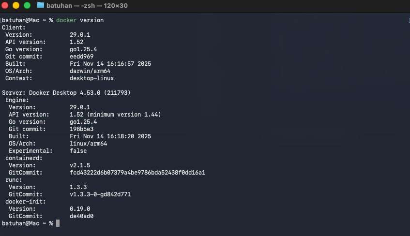

When a container runs, it receives a random name.

`docker run -it spurin/funbox --rm`: Remove the container when it exits automatically.
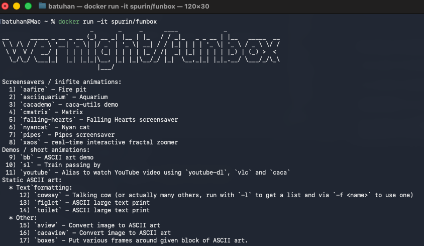
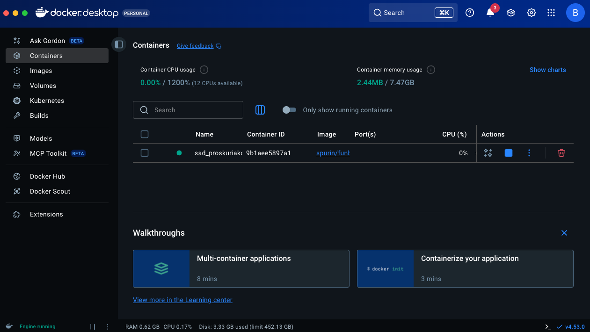

`docker ps`: Show the running containers.

`docker ps -a`: Show all containers.
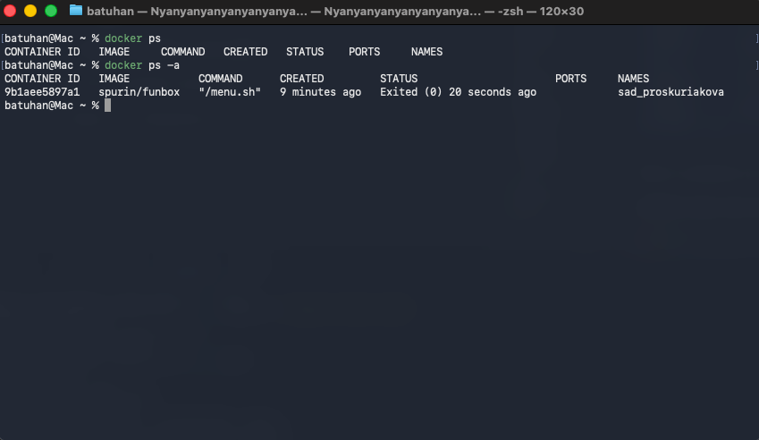

We can override the default command: `docker rubn -it spurin/funbox nyancat`

We can see that the user is John and it is specified in image layers.
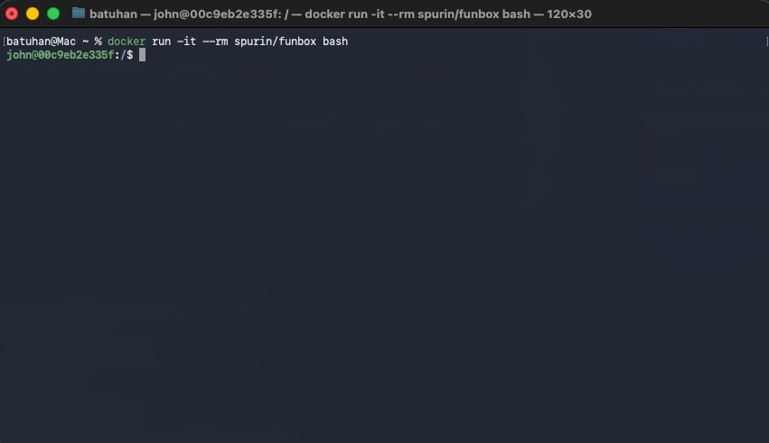
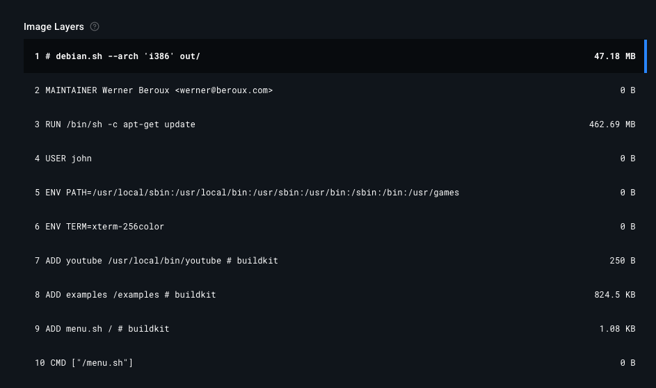

Ideally, containers should be run as non-root users.

`docker rm <container-name>`: Remove the container.

### Container Networking and Persistent Data (Volumes)

`docker run -d --rm <image>`: `-d` means detach, so the container will work in the background. The output provides a container ID.
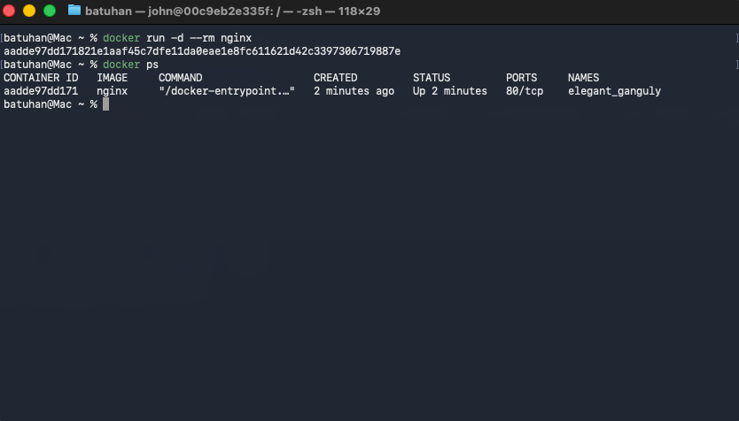

The container is published on port 80 but is not easily accessible from the local machine, so we fix this.

`docker stop <container-id>`: It is enough to write the first characters of the container ID.
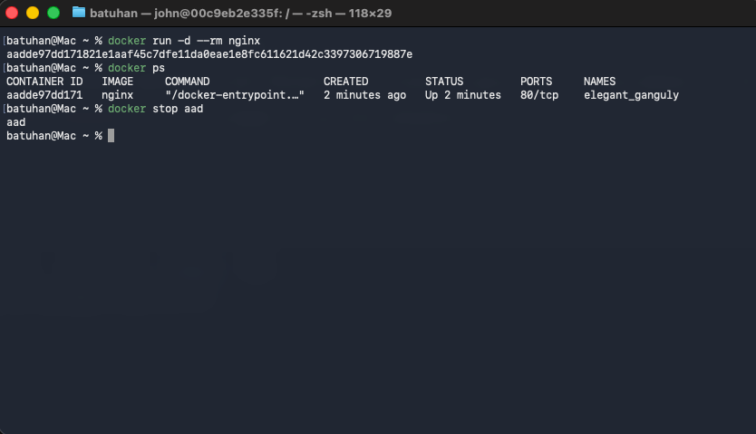

`docker run -d --rm -P <container>`: Publish all exposed ports to random ports.
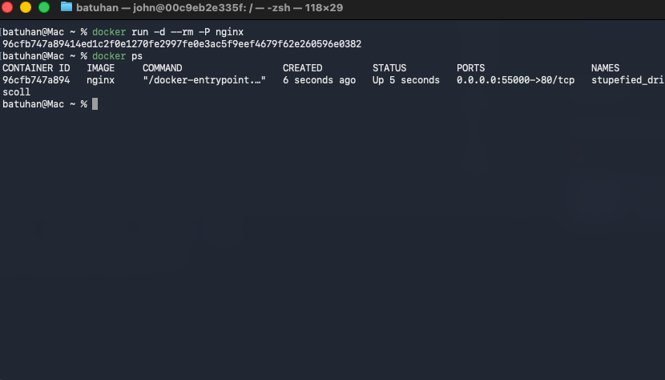

We can see that port 80 will be exposed (line 14).
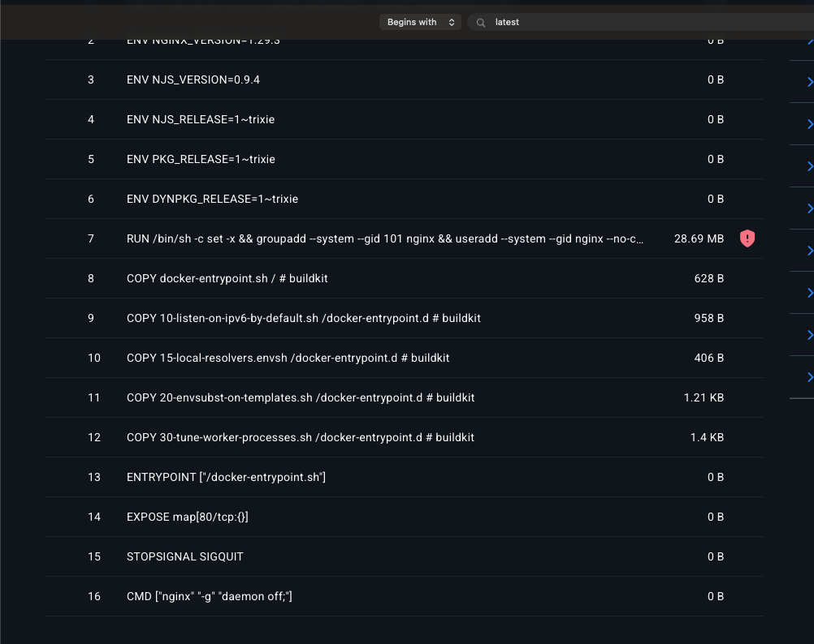
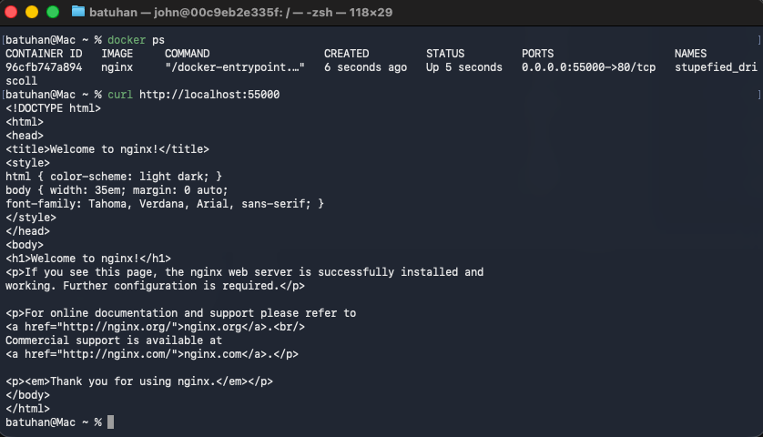

We can see the welcome page for nginx.
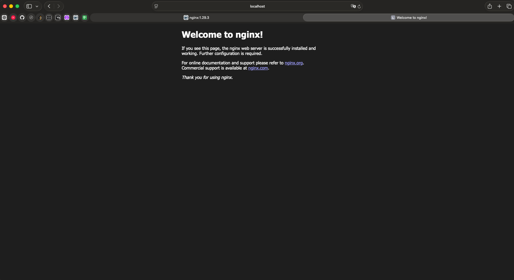

Each time, a random port will be used.

`docker run -d --rm -p 1235:80 <container-name>`: Specify the port.
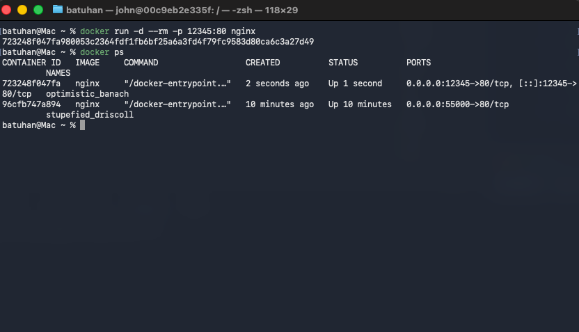
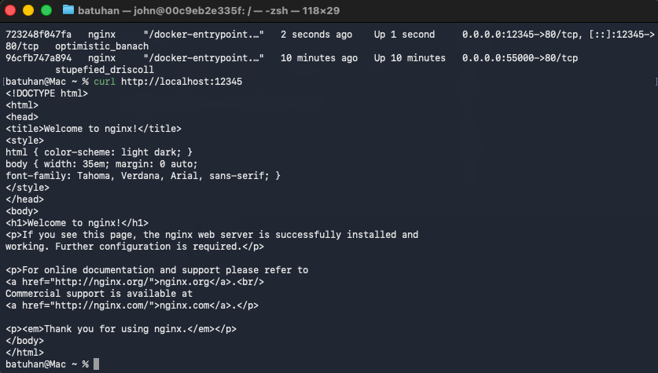

We will see the same result again in the new port.

`docker exec -it <container-id> <default-command>`: Run a command inside container.
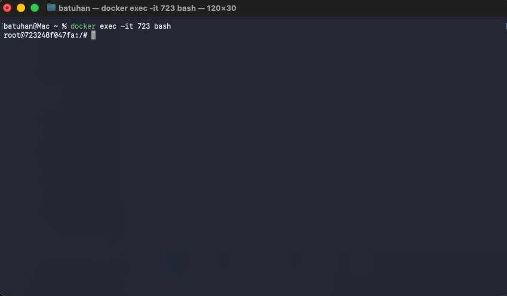

We will find the location of the file that serves the nginx welcome page.
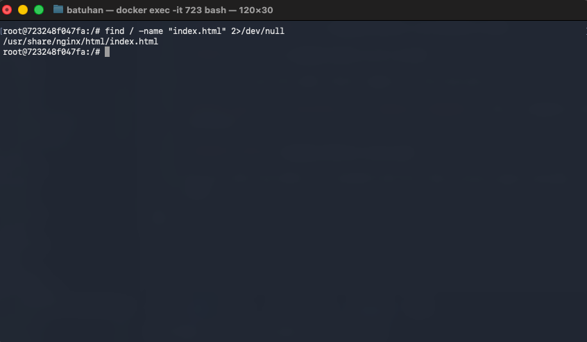

`find / -name "index.html" 2>/dev/null`: The `find` command searches for files and directories based on various criteria. It scans the specified directory and its subdirectories.

`2>/dev/null`: Run find, but hide all error messages (like "Permission denied") so only valid results are shown.

Now we will change the content of the nginx welcome page.

`echo hello > /usr/share/nginx/html/index.html`

* `echo hello`: Prints the text hello to standard output.
* `>`: Redirects the output of `echo hello` into the file, overwriting any existing content.
* `/usr/share/nginx/html/index.html`: The default document root for Nginx.

So the command overwrites `index.html` with the text "hello."

A better approach is to use a volume that contains our website and pass the volume to the container.

`exit`: Exit the container.
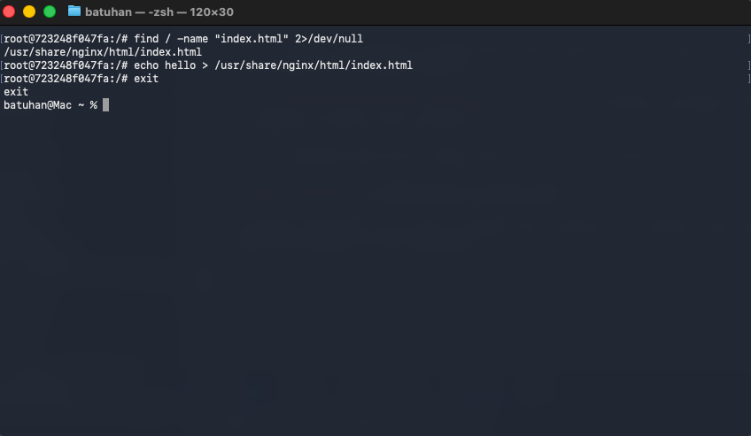

The better way to achieve the same result is to use a volume.

`docker run -d --rm -p <port> -v <local-path>:<container-path>`: A volume in Docker maps a folder on your host machine into a folder inside the container.
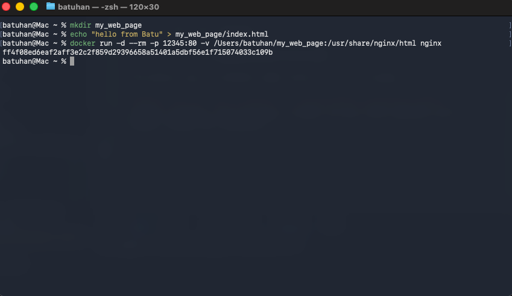

### Creating Container Images

A Dockerfile is a text file containing the commands and instructions required to assemble a container image.
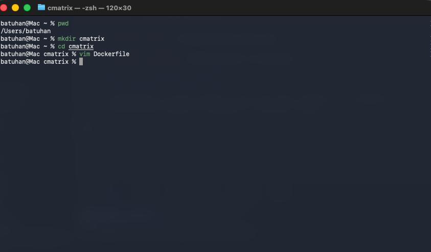

You can press `i` to enter `insert mode` when you use VIM as editor.
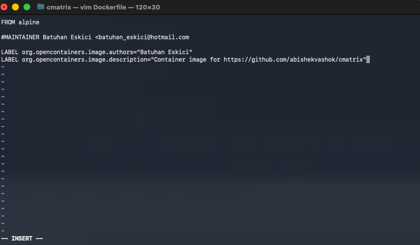

`FROM`: A Dockerfile must begin with a FROM instruction. The FROM instruction specifies the **Parent Image** from which you are building.

`LABEL`: A Docker label is a key-value metadata field that you can attach to images, containers, volumes, or other Docker objects.

After this step we can press `ESC` to exit from insert mode and type `:wp` to save and exit editor.

`docker build <working-dir> -t <tag-name>`: Build a new image by configurations.
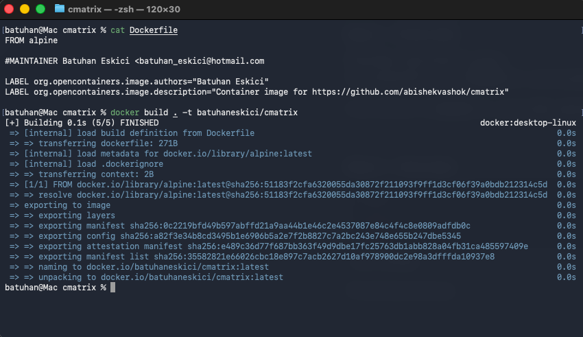

We can see our new image in the list and it has the same size with the base image.

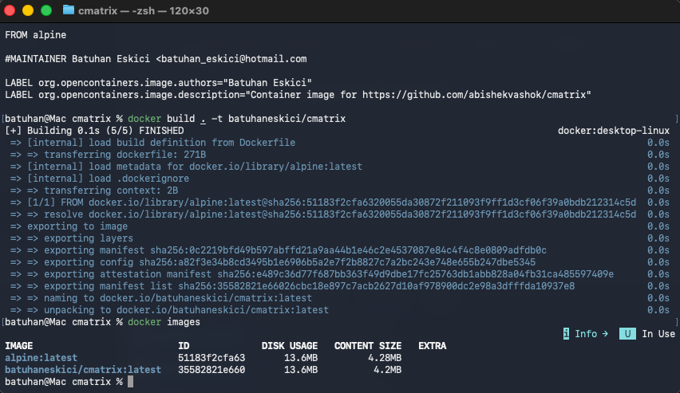

`RUN`: Docker engine will execute these statements when it see this.

`WORKDIR <directory>`: Changes the working directory for executable statements. (RUN, CMD etc.)

#### Multiple Stage Builds

`FROM <image-name> AS <image-alias>`: Creates a named build stage used for multi-stage Docker builds.

`COPY --from=<image-alias> <copy-directory> <target-directory>`: Copies only the required files from a specific build stage into the final image.

If we type whoami in container we will see that we are running the container as `root` and this is not the best practice and secure.

`RUN adduser -g "John Doe" -s /usr/sbin/nologin -D john`: Add this user.

`RUN`: Executes commands during the image build. Each RUN creates a new image layer.

`CMD`: Defines the default command that will run when the container starts.

`&&`: allows you to chain multiple commands so that each command only runs if the previous one succeeded.

* Example: `RUN apt-get update && apt-get install -y curl`.

* `-g`: name
* `-s`: nologin
* `-D`: disable password
* `-H`: doesn't create home dir

`USER john`: Switch to the user that we created.

`ENTRYPOINT [path]`: Defines the main command that will always run when a container starts.

* Any additional arguments passed to docker run will be appended after the entrypoint.

`docker buildx build --platform linux/amd64,linux/arm64 -t <image-name>`: Docker buildx is a CLI plugin that gives you access to BuildKit, Docker’s advanced image-building engine.

* Multi-platform builds
    * linux/amd64
    * linux/arm64
    * linux/arm/v7, etc.
* Better caching
    * Inline caching
    * Remote caching
    * Distributed build caching
* Parallel and distributed builds
* Additional build capabilities
    * --load, --push
    * Reproducible builds
    * More flexible Dockerfile features
* Build without needing a local Docker daemon

`docker system prune`: Remove all unused containers, networks, images (both dangling and unused), and optionally, volumes.
