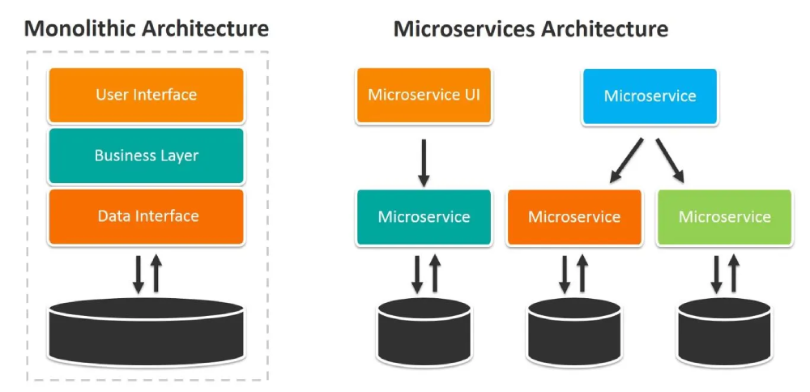
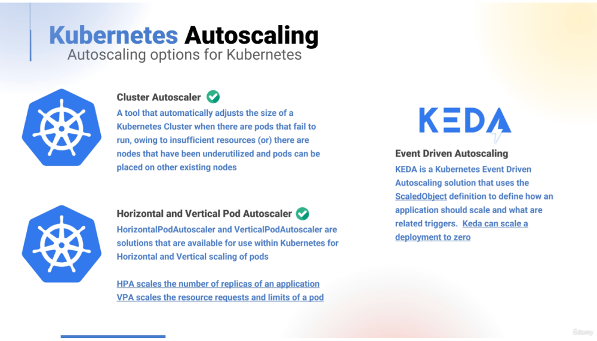
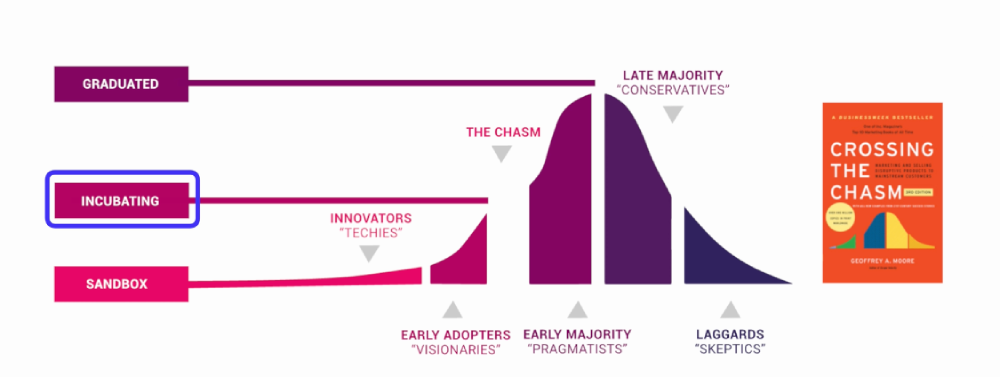
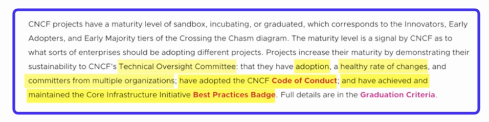

# Kubernetes Certified (KCNA) + Hands On Labs + Practice Exams

## Section 1: Course and Cloud Native Introduction

### 1. What is the meaning of 'Cloud Native'?

It applies to all cloud offerings, including Public, Private, and Hybrid Clouds.

**Public Cloud 🌐:**  Services (like computing power, storage, and networking) are offered by major providers (e.g., AWS, Google Cloud, Microsoft Azure) to the general public or large organizations.

- Applications are built to be highly scalable and resilient across the provider's global infrastructure. You utilize fully managed services (such as serverless functions, managed Kubernetes, and managed databases) offered by the vendor.

- Infinite scalability, pay-as-you-go pricing, and minimal operational overhead for the underlying infrastructure.

**Private Cloud 🔒:** The infrastructure (servers, network, storage) is located in a company's internal data center or managed by a third party solely for that organization. The organization has exclusive control and ownership.

- Organizations build their own internal platforms (often using technologies like OpenStack, VMware, or OpenShift) to mimic the service delivery model of a public cloud. They deploy cloud-native tools (like Kubernetes and Prometheus) themselves.

- Maximum control over security, data governance, and regulatory compliance.

**Hybrid Cloud 🤝:** It's a blend of two or more distinct cloud infrastructures. Data and applications can move between the two environments, providing flexibility.

- Applications are often designed to run across both environments. For instance, sensitive customer data may be kept in the Private Cloud (on-premises), while burst capacity or less sensitive data processing is handled by the Public Cloud. Cloud-native tools ensure consistency across both environments.

- Combines the security and control of a private cloud with the scalability and cost-efficiency of a public cloud.

***

### General Cloud Native Facts

| Topic | Answer |
| :--- | :--- |
| **1. What does CNCF stand for?** | **C**loud **N**ative **C**omputing **F**oundation |
| **2. Which project was the first-ever project submission to the CNCF?** | **Kubernetes** |
| **3. What is the significance of the Linux Foundation in relation to Cloud Native?** | It is responsible for hosting significant projects like the Linux Kernel, Kubernetes, and the CNCF |
| **4. When was the Linux Foundation founded?** | 2000 |
| **5. Cloud Native Architecture refers to?** | Applications built using Cloud Native best practices to run across all Cloud Native Systems |
| **6. What distinguishes Cloud Native from a legacy deployment in terms of application development?** | Applications designed for **high availability and fault tolerance**; Applications leveraging the **infrastructure** provided by cloud service providers; Applications built using **infrastructure-as-code** tools like Terraform for flexible and vendor-agnostic management |
| **7. Who was the original developer of Kubernetes?** | **Google** |

***

## Section 2: Cloud Native Architecture Fundamentals

### Cloud Native Architecture Fundamentals

The goal of Cloud Native Architecture is to effectively design applications and infrastructure.

**Best Practices:**

- Application Availability

- Cost Management

- Efficiency

- Reliability

These techniques enable loosely coupled systems that are resilient, manageable, and observable. Combined with robust automation, they allow engineers to make high-impact changes frequently and predictably with minimal toil.

#### Characteristics of Cloud Native Applications

Cloud Native Applications harness the power of the cloud to provide increased resilience, agility, operability, and observability. Let's dive a bit deeper into these characteristics.

- _Resiliency:_ Resilient applications are designed to withstand failures and continue to function or recover quickly. They typically make use of patterns such as redundancy, failover, and graceful degradation. Self-healing, where systems automatically detect and recover from failure, is a key aspect of resilient cloud-native applications. Kubernetes, for instance, has a built-in self-healing mechanism where it maintains a desired number of pod replicas and replaces failed instances.

- _Agility:_ Agility in the context of cloud-native applications refers to the ability to quickly build, modify, and deploy applications. Agile practices such as microservices and continuous delivery pipelines, backed by automation, promote rapid iteration and responsiveness to change.

- _Operability:_ Operability encompasses the ease of deploying, running, and managing applications. Cloud-native applications are designed to be easily monitored, configured, and maintained. They typically leverage automation and Infrastructure as Code (IaC) tools like Terraform to streamline operations and minimize toil.

- _Observability:_ Observability is the ability to understand the internal state of your system based on the outputs it generates. It's a critical component in diagnosing issues and understanding how an application behaves in the wild. Logging, monitoring, and tracing (collectively known as the 'three pillars of observability') are vital practices to understand the state and performance of cloud-native applications.

_It is important as part of your studies especially if you’re planning on taking the KCNA exam to remember these characteristics! A friendly anagram for this is “RAOO: Racoons are Often Observant” - Raccoons Are Often Observant = Resiliency, Agility, Operability, Observability._

### Cloud Native Practices

#### Self Healing

Kubernetes is designed with self-healing capabilities that help maintain the health and availability of workloads. It automatically replaces failed containers, reschedules workloads when nodes become unavailable, and ensures that the desired state of the system is maintained.

#### Application Automation

Kubernetes progressively rolls out changes to your application or its configuration, while monitoring application health to ensure it doesn't kill all your instances at the same time. If something goes wrong, Kubernetes will rollback the change for you.

- _Terraform:_ Defines your cloud infrastructure, such as VMs, networks, and databases, as code (IaC). It performs provisioning, declaring the desired end state of the infrastructure and figuring out how to build it. It can manage multiple cloud providers (AWS, Azure, GCP, etc.) with a single configuration. It operates in the pre-cluster stage by creating the Kubernetes cluster itself (the underlying VMs, networking, and Load Balancers) in the cloud.

- _Ansible:_ An open-source automation tool used for managing software and settings on servers and nodes. It performs configuration using simple YAML Playbooks to define tasks like installing software or managing services. It operates agentless by connecting over standard SSH. It is used in the intra/extra-cluster stage to prepare Kubernetes nodes (installing necessary binaries) or to deploy applications and configurations onto a running cluster.

- _Knative:_ A platform built on top of Kubernetes that simplifies the creation and running of serverless applications. Its primary function is providing intelligent autoscaling and event management capabilities. The Serving component scales applications based on demand, often scaling them down to zero when idle. The Eventing component allows applications to communicate asynchronously using events, enabling event-driven architectures within the cluster.

#### Autoscaling

- _Reactive Autoscaling:_ Scales resources immediately after a metric threshold (like CPU usage or latency) is breached. It’s effective for sudden, unexpected spikes but always responds after the event starts.

- _Scheduled Autoscaling:_ Scales resources based on time and date (e.g., scale up every Monday at 8 AM for the business week peak, or scale down every night at 11 PM). This handles predictable, routine traffic patterns.

- _Predictive Autoscaling:_ Uses historical data and machine learning to forecast future load requirements. It scales resources before the traffic spike hits, minimizing performance lag.

- _Vertical Autoscaling:_ Scales resources by changing the capacity of the current machine (e.g., increasing the RAM or CPU cores of an existing virtual machine). This is also known as "scaling up" or "scaling down."

- _Horizontal Autoscaling:_ Scales resources by adding or removing instances (e.g., adding more Pods or virtual machines). This is also known as "scaling out" or "scaling in."

**Real-World Daily Life Examples:**

    Coffee Shop Analogy
    Without KEDA (just HPA):

    You check how many customers are in the shop (CPU usage), and add more baristas if it's crowded.
    But you never close the shop, even at night—there’s always 1 barista on duty, even if no one's around.

    With KEDA:

    You listen for events like online coffee orders or mobile app pings.
    If no one orders coffee for an hour, you close the shop (scale to 0).
    If 50 orders come in at once, you quickly hire 5 baristas (scale up pods instantly).

**How KEDA Works:**

You define a ScaledObject in Kubernetes. Inside it, you set:

- The target deployment

- The event source (e.g., Kafka topic, queue size, custom metric)

- Scaling rules (e.g., when >100 messages, add 3 pods)

- KEDA listens and adjusts pod count accordingly.

#### Serverless

Serverless refers to using Kubernetes as the underlying infrastructure to run serverless workloads. It enables developers to execute code without managing the Kubernetes cluster operations, scaling, or resource provisioning for individual functions or services.

- _Abstraction:_ The user only defines their code (function or service) and required resources (like memory). They don't interact with Kubernetes primitives like Pods, Deployments, or Services.

- _Automatic Scaling to Zero:_ The platform automatically scales the application based on incoming traffic. When traffic stops, the service scales down to zero running instances, conserving resources and cost.

- _Event-Driven:_ Applications are often triggered by events (e.g., messages on a queue, HTTP requests) rather than running continuously.

- _Underlying Technology:_ It is typically implemented using projects built on top of Kubernetes, such as:

- _Knative:_ A leading framework that provides middleware components for building, deploying, and managing modern serverless workloads on Kubernetes.

- _KEDA (Kubernetes Event-driven Autoscaling):_ Allows Kubernetes workloads to be scaled based on external metrics (like a Kafka queue depth) rather than just CPU usage.

#### Serverless Concepts

- _AWS Lambda:_ a proprietary Function-as-a-Service (FaaS) offering from Amazon Web Services (AWS) that runs code in response to events without requiring you to manage servers. It represents the original public cloud serverless model.

- _Knative:_ a Kubernetes-native platform that extends K8s to build, deploy, and manage serverless workloads. It provides components for automatic scaling (down to zero) and eventing, effectively turning any Kubernetes cluster into a FaaS platform.

- _OpenFaaS:_ an open-source framework for building and deploying serverless functions on Kubernetes (or other platforms). It focuses on simplicity and ease of use, allowing developers to package existing code and containers as serverless functions.

- _CloudEvents:_ a standardized specification for describing event data in a common format. It ensures consistency across different serverless platforms (like Knative and FaaS providers) and communication protocols, enabling better interoperability in event-driven architectures.

### Key Pillars of Cloud Native Architecture

- _Microservices Architecture:_ Microservices architecture involves breaking down the application into loosely coupled, independently deployable components, each focusing on a single responsibility. This design enables agility, scalability, and resilience as each microservice can be developed, scaled, and managed independently.

- _Containerisation:_ Containerisation involves encapsulating an application with its dependencies into a container, which can run uniformly across different environments. It facilitates isolation, consistency, and efficiency, making applications easier to build, deploy, and manage.

- _DevOps:_ DevOps is a collaborative approach that combines software development (Dev) and IT operations (Ops) to enhance the efficiency, reliability, and speed of software delivery. By fostering a culture of excellence, DevOps emphasises automation, monitoring, and collaboration across development and operations teams.

- _Continuous Delivery (CD):_ Continuous Delivery is a practice where code changes are automatically built, tested, and prepared for a release to production. CD accelerates the release cycle, enhances productivity, and reduces the risk, complexity, and downtime of application deployment.

In essence, building cloud-native applications is a strategy that promotes resilience, agility, operability, and observability by leveraging modern technological practices. With a clear understanding of these characteristics and key pillars, organisations can fully exploit the advantages of cloud-native architectures.

This is also an important area for your studies especially with reference to the KCNA exam. A friendly acronym for this is Morning Coffee Delivers Caffeine Delight = Microservices, Containerisation, DevOps, Continuous Delivery.

### Community and Governance

- CNCF is responsible for hosting, support, oversight and direction of cloud native projects.

- Most well known being Kubernetes, but also including the likes of Envoy and Prometheus.

- **Their mission:** To make Cloud Native Computing, Ubiquitous

**Graduated projects:**
<https://www.cncf.io/projects/>

#### Cloud Native Terminology Acronyms used in the Cloud Native Community

- _TOC:_ Technical Oversight Committee

- _SIG:_ Special Interest Groups

- _TAG:_ Technical Advisory Groups

#### TAG: Technical Advisory Groups

- Provide technical guidance across specific domains that include Storage, Security, App Delivery,

- Network, Observability, Runtime, Contributor Strategy

- Guide and support new projects with the onboarding of Sandbox proposals

- Support and review CNCF projects, transitioning from Sandbox to Incubation and beyond

### Cloud Native Personas

- _DevOps:_ Automates and maintains the CI/CD pipelines that deploy code into the cluster and manages the core configuration tools like Helm and ArgoCD, bridging the gap between development and operations.

- _Site Reliability Engineer (SRE):_ Focuses on the reliability, availability, and performance of production services. They define SLOs/SLIs and use automation and engineering principles to minimize manual toil and ensure the cluster handles failures gracefully.

- _CloudOps Engineer:_ Manages the underlying cloud infrastructure (AWS, Azure, GCP) hosting the Kubernetes cluster, optimizing cloud spending, networking (VPCs), and infrastructure-level security external to the cluster itself.

- _Security Engineer:_ Designs and enforces security policies for the K8s environment, handling network segregation, access control (RBAC), auditing, and vulnerability scanning for container images and application secrets.

- _DevSecOps Engineer:_ Integrates security practices directly into the automated CI/CD pipeline and deployment lifecycle, ensuring security testing and vulnerability checks happen continuously and automatically before code hits the cluster.

- _Full Stack Developer:_ Builds and maintains all layers of a feature, from the API running in a Pod to the front-end interface, focusing on application logic, features, and performance within the containerized environment.

- _Cloud Architect:_ Designs the high-level, long-term strategy for the entire cloud ecosystem, selecting the optimal services (managed K8s vs. serverless), defining the networking blueprint, and ensuring the architecture meets business needs.

- _Data Engineer:_ Builds, manages, and optimizes the data pipelines and storage infrastructure (e.g., distributed databases, Kafka clusters) often run inside K8s, ensuring data is clean, reliable, and available for consumption.

- _FinOps Engineer:_ Manages cloud financial accountability and efficiency, monitoring Kubernetes resource utilization, optimizing resource requests/limits, and driving engineering decisions to reduce cloud spending.

- _Machine Learning Engineer:_ Deploys and manages ML models as scalable services (often using specialized K8s operators like Kubeflow), ensuring the model inference endpoints are highly available and properly resource-allocated.

- _Data Scientist:_ Focuses on analyzing data, building predictive models, and developing statistical insights. They typically consume data prepared by Data Engineers and rely on the ML Engineer to deploy their finalized models.

These roles, along with the ones covered previously, comprise some of the essential tech roles in the industry today. Each role has its unique set of responsibilities and skills required, yet they often overlap and collaborate to drive the success of the organisation's objectives. Understanding the differences and similarities between these roles is crucial for effective team building and project management in any tech-oriented organisation.

### Open Standards

Open standards in the Kubernetes context refer to the publicly available, non-proprietary specifications and protocols that govern how different components of the container ecosystem interact. These standards ensure interoperability, portability, and prevent vendor lock-in.

Kubernetes itself is built on a foundation of open standards and is governed by the Cloud Native Computing Foundation (CNCF), which promotes many of the key standards used within the ecosystem.

#### Key Open Standards and Specifications

- Containerization Standards

    These standards ensure that any container engine can run any container image, and that Kubernetes can reliably manage them.

    - _Open Container Initiative (OCI):_ This is perhaps the most critical standard. It governs the specification for two core things:

    - _Image Format Specification:_ Defines how a container image must be built and packaged (e.g., Docker images are now OCI images).

    - _Runtime Specification:_ Defines how a container runtime (like runc) must execute the container.

    - _Container Runtime Interface (CRI):_ This is a Kubernetes standard. It defines the API interface between the kubelet (the node agent) and the actual container runtime (like containerd or CRI-O).

- Networking and Storage

    These standards ensure that networking and persistent storage solutions can be easily plugged into any Kubernetes cluster.

    - _Container Network Interface (CNI):_ This is a standard specification for writing network plugins. It ensures that various networking solutions (like Calico, Flannel, or Cilium) can be consistently integrated with Kubernetes.

    - _Container Storage Interface (CSI):_ This is a standard specification for exposing arbitrary storage systems (like AWS EBS, NFS, or local storage) to container orchestration systems. It allows any storage provider to create a driver that works across different cloud environments.

- Service Mesh and Observability

    - _OpenTracing/OpenTelemetry (OTel):_ This is a standard set of APIs, libraries, and instrumentation tools for generating, collecting, and exporting telemetry data (metrics, logs, and traces). This ensures consistent observability across microservices regardless of the programming language or vendor.

    - By adhering to these open standards, Kubernetes maintains its strong position as a portable and extensible platform.

## Section 3: Containers with Docker

### Introduction to Containers

**Mainframe (1960s–1970s) — “The First Container-Like Isolation:** Mainframes (like IBM’s big iron systems) introduced the first ideas of workload isolation.

- LPARs (Logical Partitions): hardware-level isolation of workloads

- Time-sharing: multiple users isolated on the same machine

- Jails for processes before the word “container” existed

Mainframes were the first systems that allowed multiple isolated environments on one machine.
They are the conceptual ancestors of containers.

**chroot (1979) — “The First Lightweight Container Trick”:** chroot is a Unix command that changes the root filesystem for a process.

**What it provides:**

- Filesystem isolation
- Prevents a process from seeing the real system tree (partially)

**Limitations:**

- No CPU/memory isolation
- No user isolation
- Security was weak

chroot was the first step toward isolating processes, but it was NOT a container.

It provided filesystem namespaces only.

**FreeBSD Jails (2000) — “Real Containers Begin”:** FreeBSD Jails = chroot + process isolation + networking isolation

**Features:**

- Each jail has its own ip address
- Its own process tree
- Restricted root user (less escape risk)

This was the first real container-like tech.

**Virtual Machines (1990s–2000s) — “Full Hardware Isolation”:** VMs use a hypervisor to create virtual hardware.

Examples:

- VMware
- KVM
- Hyper-V
- VirtualBox

Inside each VM:

- Full OS
- Emulated hardware
- Strong isolation, but heavy

- Full OS
- Emulated hardware
- Strong isolation, but heavy

- Full OS
- Emulated hardware
- Strong isolation, but heavy

Downside:

- Slow to boot
- Takes gigabytes
- Resource-heavy
- Hard to deploy many small apps

VMs solved isolation, but not efficiency.

Containers would later solve this by removing the need for a full OS per app.

**Linux Advancements — The Foundation of Docker:**

Linux enabled true containerization through Namespaces (6) and cgroups.

**1. User Namespace (2002+):** Isolates user IDs.

- Processes can be root inside the container but non-root on the host.

**2. PID Namespace:** Provides a separate process ID tree.

- PID 1 inside a container controls only processes within that namespace.

**3. Network Namespace:** Gives each container its own networking stack:

- Interfaces
- Routing tables
- Firewall rules
- Loopback

**4. Mount Namespace:** Provides an independent filesystem hierarchy.

- Containers can mount/unmount without affecting the host.

**5. UTS Namespace:** Isolates hostname and domain name.

- Each container can have its own hostname.

**6. IPC Namespace:** Isolates inter-process communication:

- Shared memory
- Semaphores
- Message queues

**cgroups (Control Groups) — 2006:** Controls and limits resource usage:

- CPU
- Memory
- Block I/O
- Ability to freeze or throttle processes
- Namespaces provide isolation.
- cgroups provide resource control.
- Together, they form the foundation of Linux containers.

**Docker (2013) — “The Usability Revolution”** Docker combined:

- Namespaces (isolation)
- cgroups (resource limits)
- Union filesystems (layered images)

And made them:

- Easy
- Portable
- Scriptable
- Shareable (Docker Hub)
- Standardized (image format)

Docker made containers practical and accessible for developers and production systems.

